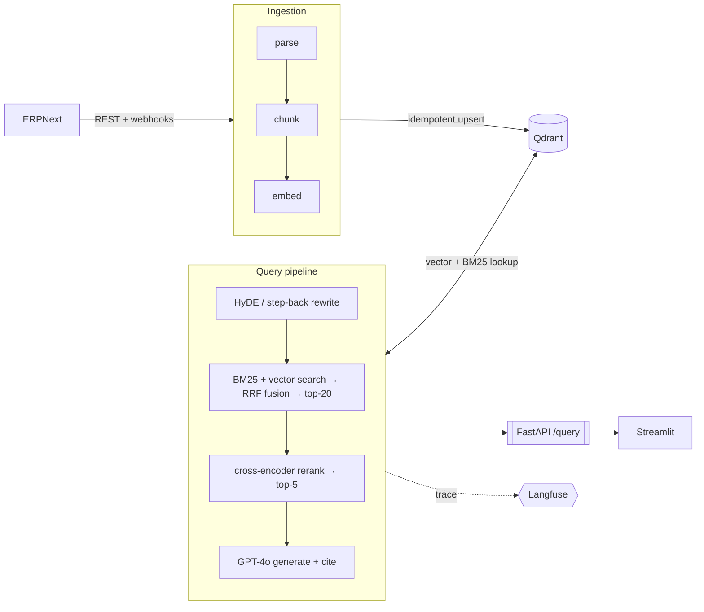

# Contract Intelligence Assistant

A production-grade RAG application that answers natural language contract queries grounded in ERPNext data.

## What It Does

Query your contract data in plain English. Each example below exercises a different part of the
architecture:

| Capability | Example question |
|---|---|
| Hybrid search — exact term (BM25) | "What penalty applies if Zuckerman Security Ltd. exceeds two service level incidents in a quarter?" |
| Hybrid search — paraphrase (vector) | "Which supplier bears the cost of replacing defective goods delivered under warranty?" |
| Cross-document synthesis (reranker) | "Compare the payment terms across our contracts with Alpha Supplies Ltd. and Summit Traders Ltd." |
| HyDE query rewriting (abstract question) | "What recourse do we have if a security services vendor doesn't perform to the agreed standard?" |
| Plain-language ↔ exact-value interpretation | "Has our contract with Zuckerman Security Ltd. been signed yet?" |
| Grounded refusal (no hallucination) | "What's our contract value with a supplier called Globex Corp?" |
| PDF ingestion | "What is Zuckerman Security Ltd.'s liability cap under the attached contract PDF, and how quickly can either party terminate for cause?" |

## Architecture



The subgraphs above are execution order, not code layout: query rewriting is the
entry point of every request and runs *before* retrieval — the rewritten text is
what BM25 and vector search actually match on. Retrieval then narrows top-20 →
top-5 (rerank) before generation. See `pipeline/query_pipeline.py` and
`docs/ARCHITECTURE.md` for the full data-flow.

See `docs/ARCHITECTURE.md` for the full data-flow and schema breakdown.

## Tech Stack

| Layer | Technology |
|---|---|
| ERP | ERPNext (Frappe REST API + Webhooks) |
| Vector DB | Qdrant (self-hosted) |
| Orchestration | Hand-rolled (`pipeline/query_pipeline.py`) — LangChain is a dependency but only used for `RecursiveCharacterTextSplitter` in `ingestion/chunker.py`, not for orchestration |
| Embeddings | `EMBEDDING_MODEL` env var, default `text-embedding-3-small` (OpenAI) — see `config.py` |
| Re-ranker | `cross-encoder/ms-marco-MiniLM-L-6-v2` |
| LLM | `OPENAI_MODEL` env var, default `gpt-4o` — see `config.py` |
| Evaluation | RAGAS |
| Observability | Langfuse (self-hosted) |
| API | FastAPI |
| Frontend | Streamlit |
| Auth | ERPNext OAuth2 + JWT (Option B) |
| Infra | Docker Compose + Nginx, GitHub Actions |

## Project Structure

```
contract-intelligence/
├── ingestion/
│   ├── erpnext_client.py       # Frappe REST API wrapper
│   ├── document_parser.py      # HTML stripping, PDF extraction, struct→text
│   ├── chunker.py              # Recursive character text splitter
│   ├── embedder.py             # OpenAI embedding wrapper (batched)
│   └── webhook_handler.py      # FastAPI webhook receiver + re-indexer
├── retrieval/
│   ├── vector_store.py         # Qdrant client wrapper
│   ├── hybrid_search.py        # BM25 + vector fusion via RRF
│   └── reranker.py             # Cross-encoder re-ranking
├── pipeline/
│   ├── query_pipeline.py       # End-to-end RAG chain with Langfuse tracing
│   └── query_rewriter.py       # HyDE / step-back query rewriting
├── api/
│   ├── main.py                 # FastAPI app (query, webhook, ingest, health)
│   ├── auth/
│   │   ├── oauth2.py           # ERPNext OAuth2 — authorize URL, token exchange, role fetch
│   │   ├── pkce.py             # PKCE code verifier / challenge generation
│   │   ├── jwt_handler.py      # JWT mint and decode
│   │   └── dependencies.py     # FastAPI Depends: get_current_user, require_allowed_role
│   └── routers/
│       └── auth.py             # GET /auth/login, GET /auth/callback
├── frontend/
│   ├── app.py                  # Streamlit chat UI (gated behind session JWT)
│   └── auth_ui.py              # "Login with ERPNext" page, OAuth redirect, logout
├── evaluation/
│   ├── test_dataset.json       # 92 Q&A pairs for RAGAS eval (incl. 8 hard multi-hop), dev/test split
│   ├── evaluate.py             # RAGAS runner (--split dev|test|all)
│   ├── results.baseline.json   # Committed reference run (frozen against --split test)
│   └── results.json            # Latest evaluation scores
├── tests/
│   ├── test_document_parser.py
│   ├── test_chunker.py
│   ├── test_embedder.py
│   ├── test_reranker.py
│   ├── test_hybrid_search.py
│   ├── test_vector_store.py
│   ├── test_query_rewriter.py
│   ├── test_query_pipeline.py
│   ├── test_webhook_handler.py
│   ├── test_erpnext_client.py
│   ├── test_api.py
│   └── test_integration.py     # Live ERPNext + Qdrant integration tests (opt-in)
├── docs/
│   ├── ARCHITECTURE.md         # System design and data flow
│   ├── IMPLEMENTATION_PLAN.md  # Ordered implementation steps
│   ├── DEPLOYMENT.md           # Auth options, infra topology, webhook setup
│   ├── SECURITY_REVIEW.md      # Security review findings and accepted risks
│   ├── DOCUMENT_LEVEL_ACCESS_CONTROL.md  # Proposed future doc-level access control (#60, not implemented)
│   ├── MODEL_PROVIDER_SWAP.md  # Developer steps to switch LLM/embedding provider (#51)
│   ├── PIPELINE_TUNING.md      # How every knob (chunk_size → rewrite → top_k → top_n → model) would be tuned
│   └── BENCHMARKS.md           # Reproducible latency & cost baseline (query + ingest paths)
├── nginx/
│   ├── nginx.conf              # Base reverse-proxy config (Option B production)
│   └── templates/
│       └── contract-intelligence.conf.template  # envsubst template for FRONTEND_DOMAIN/API_DOMAIN
├── .github/
│   └── workflows/
│       └── ci.yml              # Lint + unit tests (every push)
├── config.py                   # Central model config — OPENAI_MODEL, EMBEDDING_MODEL env vars
├── docker-compose.yml          # Production: all services on rag_internal, nginx on 80/443
├── docker-compose.frontend.yml # Dev override: exposes service ports directly to host
├── docker-compose.local-prod.yml  # Local override for testing the production nginx topology
├── Dockerfile
├── requirements.txt
├── pyproject.toml
├── .env.example
└── .gitignore
```

## Quick Start (local development)

1. Copy `.env.example` to `.env` and fill in all values.
2. In your ERPNext desk, create an OAuth2 client (**Integrations → OAuth Client**) and set the Redirect URI to `http://localhost:8000/auth/callback`. Copy the generated `client_id` and `client_secret` into `.env`.
3. Start infrastructure:
   ```bash
   docker compose -f docker-compose.yml -f docker-compose.frontend.yml up qdrant langfuse postgres -d
   ```
4. Start the API:
   ```bash
   uvicorn api.main:app --reload
   ```
5. Trigger a full ingest (requires a running ERPNext instance):
   ```bash
   curl -X POST http://localhost:8000/ingest/full \
     -H "X-Admin-Secret: <ADMIN_SECRET>"
   ```
6. Start the frontend:
   ```bash
   streamlit run frontend/app.py
   ```
7. Open `http://localhost:8501` — click **Login with ERPNext** and sign in with an allowed role (`Purchase Manager`, `Purchase User`, `Accounts User`, or `System Manager`).

## Production Deployment (Option B)

See `docs/DEPLOYMENT.md` for the full topology and step-by-step instructions. The short version:

1. Set your domains in `.env` (bare hostnames, no scheme — substituted into nginx's config
   automatically at container start, no manual file editing needed):
   ```
   FRONTEND_DOMAIN=contract-intelligence.example.com
   API_DOMAIN=api.contract-intelligence.example.com
   ```
2. Provision TLS certs for those same domains:
   ```bash
   certbot certonly --standalone \
     -d contract-intelligence.example.com \
     -d api.contract-intelligence.example.com
   ```
3. Fill in the rest of the production values in `.env`:
   - Strong random values for `WEBHOOK_SECRET`, `ADMIN_SECRET`, `JWT_SECRET`, `LANGFUSE_PUBLIC_KEY`, `LANGFUSE_SECRET_KEY`
   - Set URL vars to your actual domains:
     ```
     OAUTH_REDIRECT_URI=https://api.contract-intelligence.example.com/auth/callback
     FRONTEND_URL=https://contract-intelligence.example.com
     PUBLIC_API_URL=https://api.contract-intelligence.example.com
     ```
   - Update the ERPNext OAuth client's Redirect URI to match `OAUTH_REDIRECT_URI`
4. Start everything:
   ```bash
   docker compose up -d
   ```
   All services run on the internal `rag_internal` network; nginx is the only service with public ports (80/443).

## Environment Variables

See `.env.example` for the full list with generation instructions. Key groups:

| Group | Variables | Purpose |
|---|---|---|
| ERPNext | `ERPNEXT_URL`, `ERPNEXT_API_KEY`, `ERPNEXT_API_SECRET` | Frappe REST API access |
| Webhook | `WEBHOOK_SECRET` | HMAC-SHA256 signature verification |
| OpenAI | `OPENAI_API_KEY` | Embeddings and GPT-4o |
| Qdrant | `QDRANT_URL`, `QDRANT_COLLECTION` | Vector store |
| Langfuse | `LANGFUSE_PUBLIC_KEY`, `LANGFUSE_SECRET_KEY`, `LANGFUSE_HOST` | Tracing |
| Auth | `ERPNEXT_OAUTH_CLIENT_ID`, `ERPNEXT_OAUTH_CLIENT_SECRET`, `JWT_SECRET`, `ALLOWED_ROLES` | OAuth2 + JWT |
| URLs | `OAUTH_REDIRECT_URI`, `FRONTEND_URL`, `PUBLIC_API_URL` | OAuth callback and post-login redirect targets; must use public domains in production |
| Admin | `ADMIN_SECRET` | Gate for `POST /ingest/full` |
| Pipeline | `QUERY_REWRITE_STRATEGY` | `hyde` (default) or `step_back` |
| Model config | `OPENAI_MODEL`, `EMBEDDING_MODEL` | Defaults `gpt-4o` / `text-embedding-3-small`; see `config.py`. Changing `EMBEDDING_MODEL` to a different-dimension model requires recreating the Qdrant collection and a full re-ingest. |

## Data Sources

| Doctype | Indexing type | Notes |
|---|---|---|
| Contract | Unstructured chunks | `contract_terms` HTML stripped before chunking |
| Terms and Conditions | Unstructured chunks | Template text |
| Attached PDFs | Unstructured chunks | Extracted via Frappe File API |

## Incremental Indexing

ERPNext webhooks fire on `on_submit` / `on_cancel` / `on_update` / `on_update_after_submit` events
(the last covers `allow_on_submit` field edits, e.g. Contract's `is_signed`, made after submit). The
webhook endpoint:
1. Validates the HMAC-SHA256 signature (`X-Frappe-Webhook-Signature`)
2. Fetches the full updated document via ERPNext REST API
3. Deletes all existing Qdrant chunks for that `docname`
4. Re-parses, chunks, embeds, and upserts

See `docs/DEPLOYMENT.md` for the required ERPNext webhook records and scripted setup.

## Evaluation

```bash
python evaluation/evaluate.py
```

Runs RAGAS metrics (`faithfulness`, `answer_relevancy`, `context_recall`, `context_precision`) against `evaluation/test_dataset.json` (92 entries with a dev/test `split`; `--split dev|test|all`) and writes `evaluation/results.json` — a headline score plus a per-`case_class` breakdown. The dataset groups questions into slices: `showcase` (each row of the **What It Does** table above — easy by design), `disambiguation` / `precision-multi` / `semantic-no-anchor` (the harder cases a regression shows up in), `refusal` (checked with a string match, not RAGAS), and `aggregation` / `temporal` (known-limitation queries, scored but excluded from the headline). This is a **manual local run**, not CI — it needs a fully-ingested Qdrant collection (run a full ingest first) so retrieval, chunking and parsing are all reflected in the scores. `evaluation/results.baseline.json` is the committed reference, frozen against `--split test`; refresh it in the same PR when a change is meant to move the numbers. `scripts/generate_eval_set.py` drafts new candidate questions from the live corpus. See `docs/ARCHITECTURE.md` § Evaluation.

## CI/CD

`ci.yml` runs on every push:
- `ruff check .` — linting
- `pytest tests/` — unit tests (no network required; OpenAI and Qdrant are mocked)

That's the whole CI surface. RAGAS evaluation is **not** in CI — it's a manual local run (see [Evaluation](#evaluation) above). The LLM judge is too noisy to threshold on, and re-ingest-only changes (chunking, parsing) never surface in it — so an automated gate stays off the table regardless of dataset size.

Integration tests (`tests/test_integration.py`) require a live ERPNext + Qdrant instance and are opt-in via `RUN_INTEGRATION=1`. Run `./scripts/run_integration.sh` (optionally passing pytest args, e.g. `-m langfuse`) to save a durable log + self-contained HTML report under `test-results/` (gitignored) instead of only having them in your terminal scrollback.

A separate, browser-driven E2E suite (`tests/e2e/`, Playwright) drives the real ERPNext Desk UI and the real Streamlit UI to catch webhook-firing and content-freshness bugs the REST-based integration tests structurally can't see — see `docs/IMPLEMENTATION_PLAN.md` Step 17. One-time setup: `playwright install chromium`. Run `./scripts/run_e2e.sh` (optionally passing a path/pytest args, e.g. `tests/e2e/test_webhook_config.py`) to save a durable log + self-contained HTML report under `test-results/` (gitignored), same as `run_integration.sh`. The Streamlit frontend also has its own fast, no-browser test layer at `tests/test_streamlit.py` (`streamlit.testing.v1.AppTest`), which runs as part of the normal `pytest tests/` unit suite.
